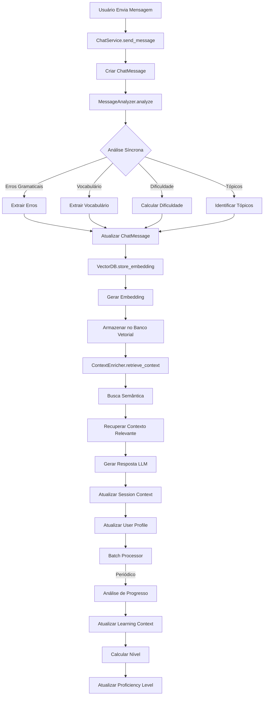

# Plano: Sistema de Coleta de Informações do Usuário

## Objetivo
Implementar sistema completo de captação, análise e armazenamento de informações do usuário para:
- Identificar nível de conhecimento baseado em interação
- Acompanhar evolução ao longo do tempo
- Personalizar interações e auxiliar no desenvolvimento do aprendizado
- Otimizar armazenamento para histórico de evolução eficiente
- Implementar busca semântica para recuperação inteligente de contexto

## Módulo de Banco Vetorial

### Estrutura do Módulo
O sistema utilizará um **módulo dedicado** (`backend/app/modules/vector_db/`) para gerenciar todas as operações relacionadas a banco vetorial. Este módulo será:

- **Modular**: Pode ser usado independentemente ou integrado
- **Extensível**: Suporta diferentes implementações (ChromaDB, Pinecone, pgvector)
- **Otimizado**: Focado em performance e escalabilidade
- **Isolado**: Separação clara de responsabilidades

### Responsabilidades do Módulo
- Geração e armazenamento de embeddings
- Busca semântica e recuperação de contexto
- Gerenciamento de collections/namespaces
- Sincronização com PostgreSQL
- Otimização e manutenção

## Arquitetura Geral

### Fluxo de Coleta de Dados



### Estrutura de Dados

#### 1. Análise de Mensagem (ChatMessage)
- `grammar_errors` (JSONB): Lista de erros detectados
- `vocabulary_suggestions` (JSONB): Palavras e sugestões
- `difficulty_score` (Float): 0.0 a 1.0
- `topics` (JSONB): Tópicos identificados
- `analysis_metadata` (JSONB): Metadados da análise

#### 2. Contexto de Sessão (ChatSession.session_context)
```json
{
  "topics_discussed": ["greetings", "food"],
  "common_errors": {
    "verb_tense": {"count": 5, "examples": [...]},
    "articles": {"count": 3, "examples": [...]}
  },
  "vocabulary_used": {
    "new_words": ["restaurant", "airport"],
    "total_unique_words": 45
  },
  "difficulty_trend": "increasing",
  "session_insights": {
    "most_common_error": "verb_tense",
    "improvement_areas": ["past_tense"]
  }
}
```

#### 3. Contexto de Aprendizado (UserProfile.learning_context)
```json
{
  "proficiency_evolution": [
    {"date": "2024-01-01", "level": "beginner", "score": 0.3},
    {"date": "2024-02-01", "level": "intermediate", "score": 0.55}
  ],
  "recurring_errors": [
    {"type": "verb_tense", "frequency": 15, "last_seen": "2024-02-01", "severity": "high"}
  ],
  "vocabulary_acquired": {
    "total_words": 250,
    "mastered_words": 180,
    "learning_words": 70
  },
  "topics_mastery": {
    "greetings": 0.9,
    "food": 0.7,
    "travel": 0.5
  },
  "learning_preferences": {
    "style": "conversational",
    "preferred_topics": ["travel"],
    "best_time": "evening"
  }
}
```

#### 4. Banco Vetorial (Vector Database)
**Collections/Namespaces**:

- **user_messages**: Embeddings de mensagens do usuário
  - Metadata: `user_id`, `session_id`, `message_id`, `created_at`, `topics`, `difficulty_score`
  
- **topics**: Embeddings de tópicos discutidos
  - Metadata: `user_id`, `topic_name`, `frequency`, `last_discussed`
  
- **corrections**: Embeddings de erros e correções
  - Metadata: `user_id`, `error_type`, `original_text`, `corrected_text`, `frequency`
  
- **vocabulary**: Embeddings de vocabulário aprendido
  - Metadata: `user_id`, `word`, `context`, `mastery_level`, `first_seen`, `last_used`
  
- **session_contexts**: Embeddings de contextos de sessões
  - Metadata: `user_id`, `session_id`, `summary`, `key_insights`

## Visão Geral das Fases

O plano está dividido em **7 fases progressivas**:

- **Fases 1-4**: Sistema básico de coleta e análise (sem banco vetorial)
  - Fase 1: Análise básica de mensagens
  - Fase 2: Atualização de contexto de sessão
  - Fase 3: Tracking de progresso e evolução
  - Fase 4: Personalização e utilização do contexto

- **Fases 5-7**: Implementação de banco vetorial e busca semântica
  - Fase 5: Infraestrutura de banco vetorial
  - Fase 6: Busca semântica e RAG
  - Fase 7: Integração completa e otimização

**Nota**: As Fases 1-4 podem ser implementadas independentemente. As Fases 5-7 dependem da infraestrutura das fases anteriores, mas podem ser implementadas em paralelo após a Fase 2.

## Fase 1: Análise Básica de Mensagens

### Objetivo
Implementar análise imediata de mensagens do usuário para extrair erros, vocabulário e dificuldade.

### Tarefas

#### 1.1 Criar MessageAnalyzer Service
**Arquivo**: `backend/app/services/message_analyzer.py`

**Responsabilidades**:
- Analisar mensagens do usuário usando LLM
- Extrair erros gramaticais estruturados
- Identificar vocabulário usado
- Calcular dificuldade da mensagem
- Identificar tópicos principais

**Métodos principais**:
```python
class MessageAnalyzer:
    def analyze_message(
        self, 
        message: str, 
        language: str,
        user_level: str
    ) -> Dict:
        """Analisa mensagem e retorna análise estruturada"""
        
    def _extract_grammar_errors(self, message: str, language: str) -> List[Dict]
    def _extract_vocabulary(self, message: str, language: str) -> Dict
    def _calculate_difficulty(self, message: str, language: str, user_level: str) -> float
    def _identify_topics(self, message: str) -> List[str]
```

#### 1.2 Integrar Análise no ChatService
**Arquivo**: `backend/app/services/chat_service.py`

**Modificações**:
- Adicionar `MessageAnalyzer` no `__init__`
- Chamar análise após criar `user_message` em `send_message`
- Armazenar resultados em `grammar_errors`, `vocabulary_suggestions`, `difficulty_score`
- Adicionar campo `topics` em `ChatMessage` (migration)

#### 1.3 Criar Migration para Campo Topics
**Arquivo**: `backend/migrations/add_topics_to_chat_message.py`

Adicionar coluna `topics` (JSONB) em `chat_messages`.

#### 1.4 Atualizar Schemas
**Arquivo**: `backend/app/schemas/schemas.py`

Adicionar `topics` em `ChatMessageResponse`.

## Fase 2: Atualização de Contexto de Sessão

### Objetivo
Implementar atualização dinâmica do `session_context` durante a sessão.

### Tarefas

#### 2.1 Criar SessionContextManager
**Arquivo**: `backend/app/services/session_context_manager.py`

**Responsabilidades**:
- Gerenciar contexto da sessão
- Agregar erros, vocabulário e tópicos
- Calcular tendências (dificuldade, progresso)
- Identificar áreas de melhoria

**Métodos principais**:
```python
class SessionContextManager:
    def update_session_context(
        self,
        session: ChatSession,
        message_analysis: Dict
    ) -> Dict:
        """Atualiza contexto da sessão com nova análise"""
        
    def _aggregate_errors(self, session_context: Dict, new_errors: List) -> Dict
    def _aggregate_vocabulary(self, session_context: Dict, new_vocab: Dict) -> Dict
    def _update_topics(self, session_context: Dict, new_topics: List) -> List
    def _calculate_trends(self, session_context: Dict) -> Dict
```

#### 2.2 Integrar no ChatService
**Arquivo**: `backend/app/services/chat_service.py`

**Modificações**:
- Adicionar `SessionContextManager` no `__init__`
- Chamar `update_session_context` após análise de mensagem
- Salvar `session_context` atualizado no banco

#### 2.3 Inicializar Session Context
**Arquivo**: `backend/app/services/chat_service.py`

Modificar `create_session` para inicializar `session_context` vazio.

## Fase 3: Tracking de Progresso e Evolução

### Objetivo
Implementar sistema de acompanhamento de evolução do usuário ao longo do tempo.

### Tarefas

#### 3.1 Criar ProgressTracker Service
**Arquivo**: `backend/app/services/progress_tracker.py`

**Responsabilidades**:
- Calcular progresso baseado em métricas
- Atualizar `learning_context` do `UserProfile`
- Identificar erros recorrentes
- Calcular evolução de vocabulário
- Determinar mudanças de nível

**Métodos principais**:
```python
class ProgressTracker:
    def update_user_progress(
        self,
        user_id: UUID,
        session_analysis: Dict
    ) -> Dict:
        """Atualiza progresso do usuário"""
        
    def _calculate_proficiency_score(self, user_profile: UserProfile) -> float
    def _identify_recurring_errors(self, user_id: UUID) -> List[Dict]
    def _update_vocabulary_stats(self, user_id: UUID, new_words: List) -> Dict
    def _check_level_change(self, user_profile: UserProfile) -> Optional[str]
```

#### 3.2 Criar Batch Processor
**Arquivo**: `backend/app/services/batch_analyzer.py`

**Responsabilidades**:
- Processar análises em lote (assíncrono)
- Analisar múltiplas sessões
- Calcular métricas agregadas
- Atualizar `learning_context` periodicamente

**Métodos principais**:
```python
class BatchAnalyzer:
    def process_user_sessions(
        self,
        user_id: UUID,
        days: int = 30
    ) -> Dict:
        """Processa sessões do usuário e atualiza progresso"""
        
    def _analyze_error_patterns(self, messages: List[ChatMessage]) -> Dict
    def _analyze_vocabulary_evolution(self, messages: List[ChatMessage]) -> Dict
    def _calculate_improvement_metrics(self, user_id: UUID) -> Dict
```

#### 3.3 Criar Tarefa Periódica
**Arquivo**: `backend/app/services/scheduler.py` ou usar Celery/APScheduler

Executar `BatchAnalyzer` periodicamente (diariamente ou semanalmente).

#### 3.4 Integrar no ChatService
**Arquivo**: `backend/app/services/chat_service.py`

Chamar `ProgressTracker` após análise de mensagem (opcionalmente assíncrono).

## Fase 4: Personalização e Utilização do Contexto

### Objetivo
Utilizar informações coletadas para personalizar interações e melhorar aprendizado.

### Tarefas

#### 4.1 Criar ContextEnricher Service
**Arquivo**: `backend/app/services/context_enricher.py`

**Responsabilidades**:
- Enriquecer prompts com contexto do usuário
- Recuperar erros recorrentes relevantes
- Incluir tópicos de interesse
- Ajustar dificuldade baseado em progresso

**Métodos principais**:
```python
class ContextEnricher:
    def enrich_system_prompt(
        self,
        base_prompt: str,
        session: ChatSession,
        user_profile: UserProfile
    ) -> str:
        """Enriquece prompt com contexto do usuário"""
        
    def _get_relevant_errors(self, session: ChatSession) -> List[Dict]
    def _get_user_preferences(self, user_profile: UserProfile) -> Dict
    def _adjust_difficulty(self, user_profile: UserProfile) -> str
```

#### 4.2 Atualizar System Prompt Builder
**Arquivo**: `backend/app/services/chat_service.py`

Modificar `_build_system_prompt` para usar `ContextEnricher` e incluir:
- Erros recorrentes do usuário
- Tópicos de interesse
- Progresso recente
- Áreas de melhoria

#### 4.3 Criar Endpoint de Insights
**Arquivo**: `backend/app/api/routes/chat.py`

Endpoint `GET /api/chat/insights/{user_id}` para retornar:
- Progresso do usuário
- Erros recorrentes
- Vocabulário aprendido
- Recomendações de estudo

#### 4.4 Atualizar Frontend (Opcional)
**Arquivo**: `frontend/src/components/Chat/Chat.tsx`

Adicionar visualização de:
- Progresso atual
- Erros comuns
- Vocabulário aprendido

## Fase 5: Implementação de Banco Vetorial - Infraestrutura

### Objetivo
Implementar infraestrutura de banco vetorial para armazenar e buscar informações do usuário de forma semântica.

### Tarefas

#### 5.1 Criar Módulo de Banco Vetorial
**Arquivo**: `backend/app/modules/vector_db/__init__.py`

Criar módulo dedicado para gerenciamento de banco vetorial com estrutura modular:
```
backend/app/modules/vector_db/
├── __init__.py
├── vector_store.py          # Interface e implementação base
├── embedding_service.py     # Geração de embeddings
├── collections.py           # Definição de collections/namespaces
└── config.py               # Configurações do banco vetorial
```

#### 5.2 Criar VectorStore Interface
**Arquivo**: `backend/app/modules/vector_db/vector_store.py`

**Responsabilidades**:
- Interface abstrata para diferentes implementações (ChromaDB, Pinecone, pgvector)
- Operações CRUD de embeddings
- Busca por similaridade
- Gerenciamento de collections

**Métodos principais**:
```python
class VectorStore:
    def store_embedding(
        self,
        collection: str,
        text: str,
        embedding: List[float],
        metadata: Dict
    ) -> str:
        """Armazena embedding com metadados"""
        
    def search_similar(
        self,
        collection: str,
        query_embedding: List[float],
        limit: int = 10,
        filters: Optional[Dict] = None
    ) -> List[Dict]:
        """Busca itens similares"""
        
    def delete_by_id(self, collection: str, id: str) -> bool
    def update_metadata(self, collection: str, id: str, metadata: Dict) -> bool
```

#### 5.3 Criar EmbeddingService
**Arquivo**: `backend/app/modules/vector_db/embedding_service.py`

**Responsabilidades**:
- Gerar embeddings usando modelos de embedding
- Suportar múltiplos modelos (OpenAI, Sentence-BERT, etc.)
- Cache de embeddings para otimização
- Normalização de embeddings

**Métodos principais**:
```python
class EmbeddingService:
    def __init__(self, model_name: str = "sentence-transformers/all-MiniLM-L6-v2")
    
    def generate_embedding(self, text: str) -> List[float]:
        """Gera embedding para texto"""
        
    def generate_batch_embeddings(self, texts: List[str]) -> List[List[float]]:
        """Gera embeddings em lote"""
        
    def _load_model(self)
    def _normalize_embedding(self, embedding: List[float]) -> List[float]
```

#### 5.4 Implementar ChromaDB Store (ou alternativa)
**Arquivo**: `backend/app/modules/vector_db/chroma_store.py`

Implementação concreta usando ChromaDB (ou Pinecone/pgvector):
- Inicialização e conexão
- Criação de collections
- Operações de armazenamento e busca
- Gerenciamento de persistência

#### 5.5 Definir Collections
**Arquivo**: `backend/app/modules/vector_db/collections.py`

Definir collections/namespaces para diferentes tipos de dados:
- `user_messages`: Mensagens do usuário
- `topics`: Tópicos discutidos
- `corrections`: Erros e correções
- `vocabulary`: Vocabulário aprendido
- `session_contexts`: Contextos de sessões

#### 5.6 Configurar Banco Vetorial
**Arquivo**: `backend/app/modules/vector_db/config.py`

Configurações:
- Tipo de banco vetorial (ChromaDB, Pinecone, pgvector)
- Caminho de persistência
- Modelo de embedding
- Dimensões de embedding
- Configurações de conexão

## Fase 6: Busca Semântica e RAG

### Objetivo
Implementar busca semântica e RAG (Retrieval-Augmented Generation) para recuperar contexto relevante do histórico do usuário.

### Tarefas

#### 6.1 Criar SemanticSearch Service
**Arquivo**: `backend/app/modules/vector_db/semantic_search.py`

**Responsabilidades**:
- Buscar mensagens similares no histórico
- Buscar tópicos relacionados
- Buscar erros e correções similares
- Buscar vocabulário relacionado

**Métodos principais**:
```python
class SemanticSearch:
    def search_similar_messages(
        self,
        user_id: UUID,
        query: str,
        limit: int = 5
    ) -> List[Dict]:
        """Busca mensagens similares do usuário"""
        
    def search_related_topics(
        self,
        user_id: UUID,
        topic: str,
        limit: int = 5
    ) -> List[Dict]:
        """Busca tópicos relacionados"""
        
    def search_similar_errors(
        self,
        user_id: UUID,
        error_type: str,
        limit: int = 5
    ) -> List[Dict]:
        """Busca erros similares"""
        
    def search_vocabulary_context(
        self,
        user_id: UUID,
        word: str,
        limit: int = 5
    ) -> List[Dict]:
        """Busca contexto de uso de vocabulário"""
```

#### 6.2 Criar RAG Service
**Arquivo**: `backend/app/modules/vector_db/rag_service.py`

**Responsabilidades**:
- Recuperar contexto relevante para prompts
- Combinar múltiplas buscas semânticas
- Filtrar e rankear resultados
- Formatar contexto para LLM

**Métodos principais**:
```python
class RAGService:
    def retrieve_relevant_context(
        self,
        user_id: UUID,
        session: ChatSession,
        query: str,
        context_types: List[str] = ["messages", "topics", "errors"]
    ) -> Dict:
        """Recupera contexto relevante para enriquecer prompt"""
        
    def _combine_search_results(self, results: List[List[Dict]]) -> List[Dict]
    def _rank_by_relevance(self, results: List[Dict], query: str) -> List[Dict]
    def _format_for_prompt(self, context: Dict) -> str
```

#### 6.3 Integrar Armazenamento de Embeddings
**Arquivo**: `backend/app/services/chat_service.py`

**Modificações**:
- Após análise de mensagem, gerar embedding
- Armazenar embedding no banco vetorial com metadados
- Armazenar embeddings de tópicos, erros e vocabulário

#### 6.4 Integrar Busca Semântica no ContextEnricher
**Arquivo**: `backend/app/services/context_enricher.py`

**Modificações**:
- Usar `RAGService` para recuperar contexto relevante
- Incluir mensagens similares no prompt
- Incluir erros e correções relacionadas
- Incluir tópicos e vocabulário relacionados

## Fase 7: Integração Completa e Otimização

### Objetivo
Integrar banco vetorial completamente no sistema e otimizar para uso em produção.

### Tarefas

#### 7.1 Criar Batch Embedding Processor
**Arquivo**: `backend/app/modules/vector_db/batch_embedding_processor.py`

**Responsabilidades**:
- Processar mensagens antigas em lote para gerar embeddings
- Migrar dados existentes para banco vetorial
- Atualizar embeddings quando necessário
- Limpar embeddings obsoletos

**Métodos principais**:
```python
class BatchEmbeddingProcessor:
    def process_historical_messages(
        self,
        user_id: UUID,
        days: int = 90
    ) -> Dict:
        """Processa mensagens históricas para gerar embeddings"""
        
    def migrate_existing_data(self, user_id: UUID) -> Dict
    def update_embeddings(self, message_ids: List[UUID]) -> Dict
    def cleanup_old_embeddings(self, days: int = 365) -> int
```

#### 7.2 Criar VectorDB Manager
**Arquivo**: `backend/app/modules/vector_db/manager.py`

**Responsabilidades**:
- Gerenciar ciclo de vida do banco vetorial
- Sincronização com PostgreSQL
- Backup e restore
- Monitoramento e métricas

**Métodos principais**:
```python
class VectorDBManager:
    def sync_with_postgres(self, user_id: UUID) -> Dict
    def backup_collection(self, collection: str) -> str
    def restore_collection(self, collection: str, backup_path: str) -> bool
    def get_stats(self, collection: str) -> Dict
```

#### 7.3 Otimizar Busca Semântica
**Arquivo**: `backend/app/modules/vector_db/semantic_search.py`

**Otimizações**:
- Cache de buscas frequentes
- Índices otimizados
- Filtros eficientes por usuário
- Limite de resultados inteligente

#### 7.4 Criar Endpoints de Busca
**Arquivo**: `backend/app/api/routes/chat.py`

Endpoints:
- `GET /api/chat/search/similar-messages` - Buscar mensagens similares
- `GET /api/chat/search/related-topics` - Buscar tópicos relacionados
- `GET /api/chat/search/similar-errors` - Buscar erros similares

#### 7.5 Integrar no Fluxo Completo
**Arquivo**: `backend/app/services/chat_service.py`

**Modificações**:
- Armazenar embeddings automaticamente após análise
- Usar busca semântica para enriquecer contexto
- Integrar RAG no processo de geração de resposta

#### 7.6 Criar Tarefa de Manutenção
**Arquivo**: `backend/app/services/scheduler.py`

Tarefas periódicas:
- Processar embeddings pendentes
- Limpar embeddings antigos
- Otimizar índices
- Sincronizar com PostgreSQL

## Otimizações de Armazenamento

### Estratégias

#### PostgreSQL

1. **Índices**:
   - `chat_messages.created_at` (já existe)
   - `chat_messages.session_id` (já existe)
   - `chat_sessions.user_id` (já existe)
   - Adicionar índice em `chat_messages.role` para filtrar mensagens do usuário
   - Adicionar índice GIN em campos JSONB (`grammar_errors`, `topics`, `vocabulary_suggestions`)

2. **Particionamento** (futuro):
   - Particionar `chat_messages` por data (mensal)
   - Particionar `token_usage` por data

3. **Compressão**:
   - Comprimir mensagens antigas (> 6 meses)
   - Manter apenas análises agregadas para mensagens muito antigas

4. **Limpeza**:
   - Manter análises detalhadas por 90 dias
   - Após 90 dias, manter apenas métricas agregadas

#### Banco Vetorial

1. **Índices Vetoriais**:
   - Usar HNSW (Hierarchical Navigable Small World) para busca rápida
   - Configurar parâmetros de índice (M, ef_construction) para balancear velocidade/precisão

2. **Particionamento por Usuário**:
   - Separar collections por usuário ou usar filtros eficientes
   - Facilitar backup e limpeza por usuário

3. **Cache de Embeddings**:
   - Cachear embeddings de mensagens frequentes
   - Reduzir recálculo de embeddings

4. **Limpeza Automática**:
   - Remover embeddings de mensagens deletadas
   - Limpar embeddings antigos (> 1 ano) periodicamente
   - Manter apenas embeddings mais relevantes

5. **Otimização de Busca**:
   - Limitar busca a usuário específico
   - Usar filtros de metadata para reduzir espaço de busca
   - Implementar busca hierárquica (primeiro por usuário, depois semântica)

## Estrutura de Arquivos

```
backend/app/
├── services/
│   ├── message_analyzer.py          # Fase 1
│   ├── session_context_manager.py    # Fase 2
│   ├── progress_tracker.py           # Fase 3
│   ├── batch_analyzer.py             # Fase 3
│   ├── context_enricher.py           # Fase 4
│   └── scheduler.py                  # Fase 3 (opcional)
│
├── modules/
│   └── vector_db/                    # Módulo de Banco Vetorial (Fases 5-7)
│       ├── __init__.py
│       ├── vector_store.py           # Interface e implementação base
│       ├── embedding_service.py     # Geração de embeddings
│       ├── collections.py            # Definição de collections
│       ├── config.py                # Configurações
│       ├── chroma_store.py           # Implementação ChromaDB (ou alternativa)
│       ├── semantic_search.py       # Busca semântica (Fase 6)
│       ├── rag_service.py           # RAG Service (Fase 6)
│       ├── batch_embedding_processor.py  # Processamento em lote (Fase 7)
│       └── manager.py               # Gerenciamento geral (Fase 7)
│
└── migrations/
    └── add_topics_to_chat_message.py # Fase 1
```

## Dependências

### Novas Dependências

#### Fases 1-4
- Nenhuma nova dependência externa necessária (usa LLMs existentes)
- Opcional: `celery` ou `apscheduler` para tarefas periódicas (Fase 3)

#### Fases 5-7 (Banco Vetorial)
- **ChromaDB**: `chromadb>=0.4.0` (ou alternativa: Pinecone, pgvector)
- **Sentence Transformers**: `sentence-transformers>=2.2.0` (para embeddings)
- **NumPy**: `numpy>=1.24.0` (para operações vetoriais)
- **Opcional**: `faiss-cpu` ou `faiss-gpu` (para busca vetorial otimizada)
- **Opcional**: `openai` (se usar OpenAI embeddings)

## Métricas de Sucesso

1. **Fase 1**: Mensagens analisadas com erros, vocabulário e dificuldade
2. **Fase 2**: `session_context` atualizado dinamicamente
3. **Fase 3**: `learning_context` reflete progresso real do usuário
4. **Fase 4**: Prompts personalizados melhoram qualidade das respostas
5. **Fase 5**: Banco vetorial operacional com armazenamento de embeddings
6. **Fase 6**: Busca semântica recupera contexto relevante com precisão > 80%
7. **Fase 7**: Sistema completo integrado com RAG melhorando qualidade das respostas

## Fluxo Completo com Banco Vetorial

### Fluxo de Armazenamento
1. Usuário envia mensagem
2. Mensagem é analisada (Fase 1)
3. Embedding é gerado da mensagem
4. Embedding é armazenado no banco vetorial com metadados
5. Tópicos, erros e vocabulário também são armazenados como embeddings

### Fluxo de Recuperação (RAG)
1. Nova mensagem do usuário
2. Embedding da mensagem é gerado
3. Busca semântica no banco vetorial:
   - Mensagens similares
   - Tópicos relacionados
   - Erros e correções similares
   - Vocabulário relacionado
4. Contexto recuperado é formatado
5. Contexto é incluído no prompt do LLM
6. Resposta é gerada com contexto enriquecido

## Próximos Passos Após Implementação Completa

1. Adicionar visualizações de progresso no frontend
2. Criar relatórios de progresso para usuários
3. Implementar recomendações inteligentes de estudo baseadas em busca semântica
4. Adicionar análise de sentimentos e engajamento
5. Implementar sistema de gamificação baseado em progresso
6. Criar dashboard de analytics para professores/administradores
